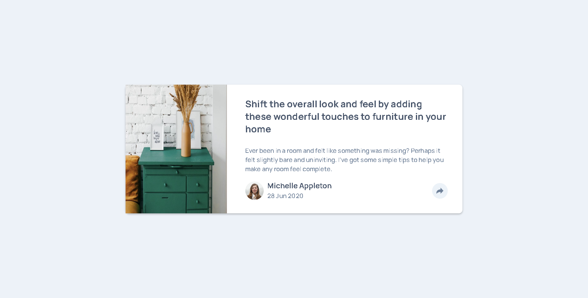

# Frontend Mentor - Article preview component solution

This is a solution to the [FAQ accordion card challenge on Frontend Mentor](https://www.frontendmentor.io/challenges/faq-accordion-card-XlyjD0Oam). Frontend Mentor challenges help you improve your coding skills by building realistic projects.

## Table of contents

- [Overview](#overview)
  - [Screenshot](#screenshot)
  - [Links](#links)
- [My process](#my-process)
  - [Built with](#built-with)
  - [What I learned](#what-i-learned)
- [Author](#author)
- [Acknowledgments](#acknowledgments)

## Overview

### Screenshot

### Links

- Solution URL: [GIT](https://github.com/Sittisukintaruk/Frontend-Mentor---FAQ-accordion-card-solution)
- Live Site URL: [Live](https://dainty-profiterole-62e128.netlify.app/)

## My process

### Built with

- Semantic HTML5 markup
- CSS custom properties
- Flexbox

**Note: These are just examples. Delete this note and replace the list above with your own choices**

### What I learned

กลับมาทบทวน

## Author

- Frontend Mentor - [@yourusername](https://www.frontendmentor.io/profile/yourusername)
